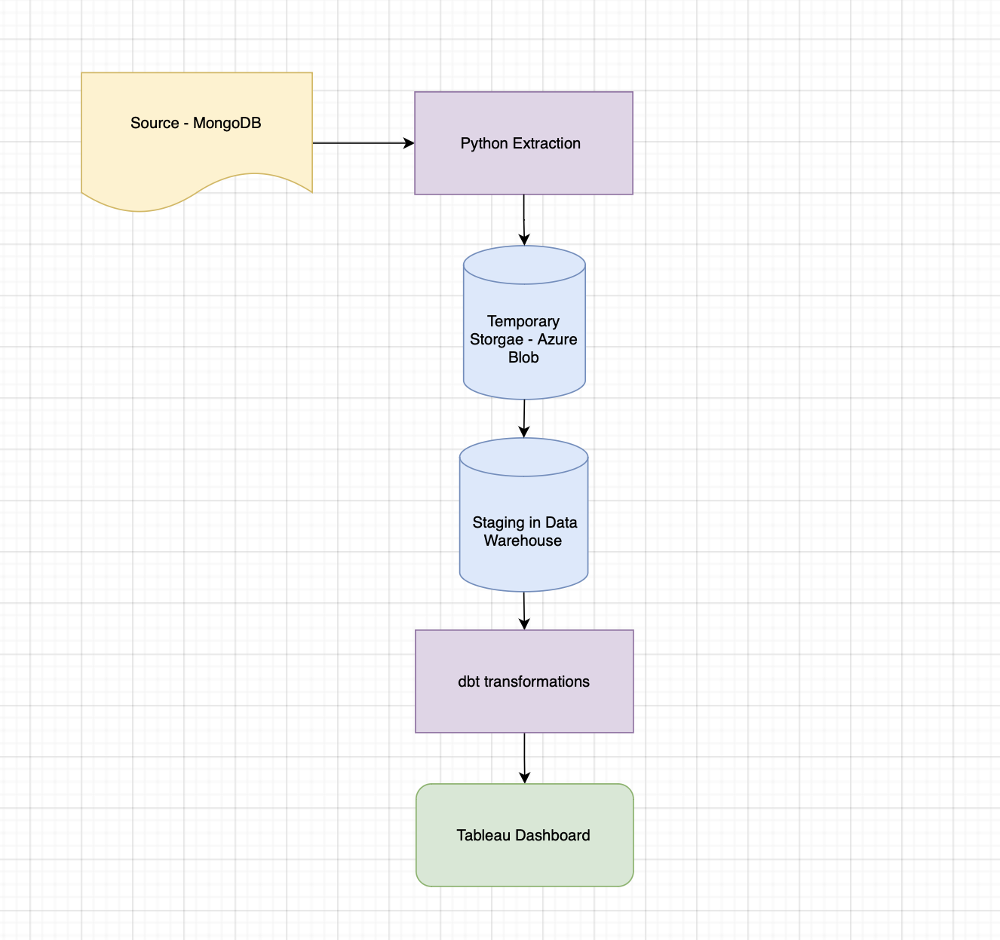
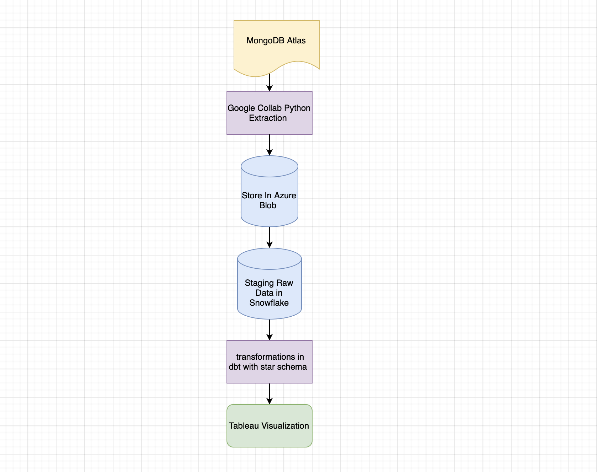

# Doctors Ratings Evaluation On RateMDs - CIS 4400 Project 2  
**Group 1 - Baruch College, Summer 2025**   
**Data Engineers: Amina Jobarteh & Brayan Benito Tirado**  

## Problem Context
RateMD is a website that allows users to find doctors locally and view their ratings and patients’ experiences with them. You can filter these ratings by location, specialty, service, facilities, etc. Patients rely on RateMD to find suitable healthcare providers; therefore, we must ensure the data maintains its value of consistency and reliability. 

A data warehouse will be created to evaluate and analyze the ratings of doctors, preferably in the U.S.A., based on contributing factors such as location, services, specialty, and number of doctors. This analysis will allow us to query and analyze different metrics and KPI’s such as ratings, location, trends, and doctor population. It will also reveal patterns that can aid in decision-making for healthcare administrators and facilities

## Requirements   
### Requirements Analysis
- **Business Personas**
  - The stakeholders involved in this project are the following:
       - Data Analyst: Responsible for data analysis and reporting.
       - Healthcare Administrators & Analysts: Can use analysis to understand RateMD’s reliability.They can also use the UI visualization to make decisions for facilities. 

- **Risks**  
  - Potential risks and challenges: 
    - Continuous updates of records can throw off accuracy
    - Lack of consistent data between locations and ratings.
    - Missing or incomplete data on specific fields (Location, zip code, specialty). 

- **Costs** 
    - Software licenses: $0  
       - All tools used (MongoDb, Tableau, Python) are free to use.  
    - Hardware upgrades: $0  
       - Personal computers are being used for this project, therefore no addiional hardware is needed.  
    - Data access: $0  
       - Data is Provided by the professor via MongoDb.  
    - Total Estimated Cost: $0
- **Timeline**  
    - Week 1: Requirements Gathering and Data Understanding
        - Define busniess and functional requirements
    - Week 2: Extract and clean data from MongoDB; begin ETL pipeline setup
        - Clean and trandform data for analysis
    - Week 3: Data Integration and Preparation
        - Load cleaned data into structured format.
        -  Begin building visualization dashboard on Tableau.
    - Week 4: Analysis, and Visualization
        - Finalize visualizations
        - Run queries (avg/min/max ratings per state, county, zip and spciality)  
    - Week 5: Final Report, Presentation and Submission
        - Complete README, presentation slides and tableau visuals
- **Benefits**
  	- Reviews and ratings data can help drive decisions based on ways to improve the quality of doctor performance and specialties. 
	- Identify locations with the lowest number of practicing doctors and how to improve that population density. 
	- Information from the data can help organize job placements for aspiring doctors based on location.
 	- Data consistency can potentially increase patient reliance on RateMD
   	  
## Business Requirements:  
Analyze and visualize doctor ratings from RateMDs to provide insights into healthcare quality accross different regions, and help patients make informed choices:  
- Identify geographic trends in doctor ratings at the state, county and zip code.  
- Determine which specialities perfrom best or worst in specific regions.  
- Help patients locate areas with high-rated doctors based on speciality and location.
  
We’ll be identifying the average, minimum, maximum, and total number of doctor ratings
-	Per county
-	Postal code
-	Per specialty 
-	Per state
  
This will be conducted to determine which county, state, and zip code have the lowest doctor ratings. 
 

## Functional Requirements
- The functional requirements for the project, detailing the core features and actions.   
  - System must allow users to filter doctor ratings by state, county or zip code.  
  - Users must be able to view average, minimum, maximum and count of doctor ratings for a selected location.  
  - System should display ratings by speciality within the chosen location.
  - Data must be consistently and accurately grouped by region and specialty.   
    
## Data Requirements
The data required for this process will be retrieved from a MongoDB database with over 2 million records from RateMD. The region analyzed will mainly be in the United States. 

From MongoDB, we’ll be analyzing and querying the following fields for our schema and dimensional modeling: 
-	Doctor ID 
-	Latitude, Longitude
-	Province, Country, City, Zip code 
-	Ratings, rating count
-	Rating services, Rating Facilities
-	Punctuality, Cleanliness, Neutrality, Helpfulness, Knowledge
-	Specialty

## Architecture
### Information Architecture
 - Source:
      - The RateMD database is stored in MongoDB
      - The database was accessed via a connection string
 - Gather Data:
      - A Python script was used to connect and extract the data
      - Due to the size of the data (2.2 million records), the script extracted the data to a temporary storage (Azure blob container) in chunks (100k records at a time). 
 - Clean, Reformat, and Transform:
      - The Python script will clean data by identifying missing and inconsistent fields
      - The cleaned data will help us query the average, minimum, maximum, and total number of doctor ratings per specific field. 
 - Data Warehouse Loading: 
      - Data is loaded and stored into the data warehouse

[Information Architecture Diagram File](https://drive.google.com/file/d/1yQ8kCZqVHiXviDYuDzm0dMQ2HInWzBGS/view?usp=sharing)

### Data Architecture
- Raw data is stored in the MongoDB database
- Raw data goes through an ETL pipeline for extracting and cleaning. This process is done to retrieve the relevant fields in the data.
- Clean data is then stored in the Azure blob container as temporary storage.
- Data is loaded into a data warehouse structured by star schema
- Tableau connects to the warehouse for visualization

[Data Architecture Diagram File](https://drive.google.com/file/d/1KyyZ2T4iE91hcL56lzhs4_uFFrmGei2U/view?usp=sharing)

### Technical Architecture
- The software and hardware systems involved in this project are:
     - Python for ETL pipeline and scripting
     - Azure for cloud computing and temporary storage
     - MongoDB as a source of data
     - Tableau for data visualization
     - Google Collab/Jupyter Notebook for testing Python scripts
     - DB Schema for star schema modeling
     - Excel for star schema planning
  
[Technical Architecture Diagram File](https://drive.google.com/file/d/1jEL6L44DEp3OfYQefv5G5MtxkTkDfVfS/view?usp=sharing)

### Product Architecture
- Product Overview:
     - This product contains an ELT data pipeline and warehousing process that will allow us to understand relevant information and insights behind doctor/healthcare provider ratings, population, and location. The goal is to ensure that the product helps us fulfill our business, functional, and data requirements.
  
- Main Components:
- Data Source 
     - Healthcare provider data from RateMD is connected and contains data on doctor location, specialty, rating, appointment availability, etc.
- Python Extraction Script
     - Python scripts were used to extract the data. 
- Temporary Storage
     - The extracted data was stored in an Azure blob in case of any modification or errors when loading the data.
- Data Warehouse
     - Raw data is loaded into the Snowflake warehouse. 
- Transformation
     - This process contains cleaning, reformatting, and transforming the data to remove inconsistencies and help us retrieve relevant information about doctor ratings. 
- Data Visualization for Analytics 
     - The visualization will be created using Tableau, which will help us figure out which county, state, and zip code has the lowest/highest doctor ratings. It also helps us answer whether or not our business, functional, and data requirements were fulfilled. 

## Dimensional Modeling  
### Dimensional Modeling
Our project uses a **star schema** approach to organize the RateMD data. The central `fact_ratemd` table captures metrics such as average ratings, rating counts and service scores. This fact table is connected to three supporting dimension tables: 
- `dim_location`: Provides geographic details such as county, state and zip code.
- `dim_specialty`: Provides doctor specialty information.  
- `dim_date`: This dimension provides date breakdown by day, month, quarter, and year.
This star schema model supports filtering and slicing of data across geography, specialties and time. 
    

# Methodology and Implementation  
We used a modified agile approach, across five weeks. Each sprint focused on key milestones from connection to data sources to modeling, trasnforming and visualizing the data. Tasks were divided by sprints and assigned among group members. 

### Sprint 1: Data Collection and Storage  
- We connected to **MongoDb**, which was our source of rateMD data. 
- Using **Google Colab**, we authenticated to MongoDb and extracted the data.  
- Because the dataset was too large to dowload all at once, we extracted it in chunks - this helped avoid memory errors.
- The dowloaded data was then uploaded to **Azure Blob Storage**, which we used as our central cloud respository.
  
### Sprint 2: Data Processing and Modeling  
-  We cleaned and flattened the nested data fields - for example, converting `location.rating.cleanliness` into a clear named column: `rating_cleanliness`.  
-  We desgined a star schema using DbSchema, featuring one central fact table and three supporting dimension tables.
-  Dimension tables include:
      - `dim_location`
      - `dim_date`
      - `dim_specialty`
- A  was also created to describe the data fields. 
### Spring 3: ELT pipeline and Transformation  
Once the dimensional model was in place, we implemented layer using modern data tooling.  
- We used dbt to create SQL-based models that transformed the raw data into cleaned, warehouse-ready tables.
- The process followed an ELT approach:  
  - **Extract**: From MongoDB.    
  - **Load**: Upload files into Azure Blob Storage, then load into snowflake.  
  - **Transform**: Use dbt models to clean, rename and structure the data.
- The transformed output matched our dimensional models, ensuring consistency.

### Spring 4: Visualization Planning & Wireframing  
- We started designing a wireframe to outline the key Tableau visualizations we want to build.
- These visuals are based on our requirements and will help answer questions.
- Final dashboards will be built using Tableau, and the visuals will be based on the fleaned fact and dimension tables in snowflake.   
## F. Visualization
Provide details of the visualizations created for the project.

- Include charts, graphs, and any other visual representation of the data.
  - 
- Mention any libraries or tools used for visualization (e.g., Matplotlib, Power BI).

## G. Insights
Highlight any key insights gained from the project.

- Provide an overview of what was learned or discovered through data analysis.
- Example:
  - High correlation between customer satisfaction and response time.
  - Significant opportunity for cost reduction in supply chain operations.

## H. Conclusion
Summarize the outcomes of the project and any potential next steps.

- What was achieved?
- How can the results be used moving forward?
- Example:
  - The project successfully reduced costs by 20% through process automation.
  - Future work may include expanding the solution to new departments.

## I. References
- Provide a list of all references used in the project, formatted according to MLA style.

1. Author Last Name, First Name. *Title of Book*. Publisher, Year.
2. "Title of Article." *Name of Journal*, vol. 1, no. 1, Year, pp. 1-10.
3. *Title of Website*. Website Publisher, Year, URL.

---

*Replace placeholders like "path_to_image" with actual file paths or URLs.*
